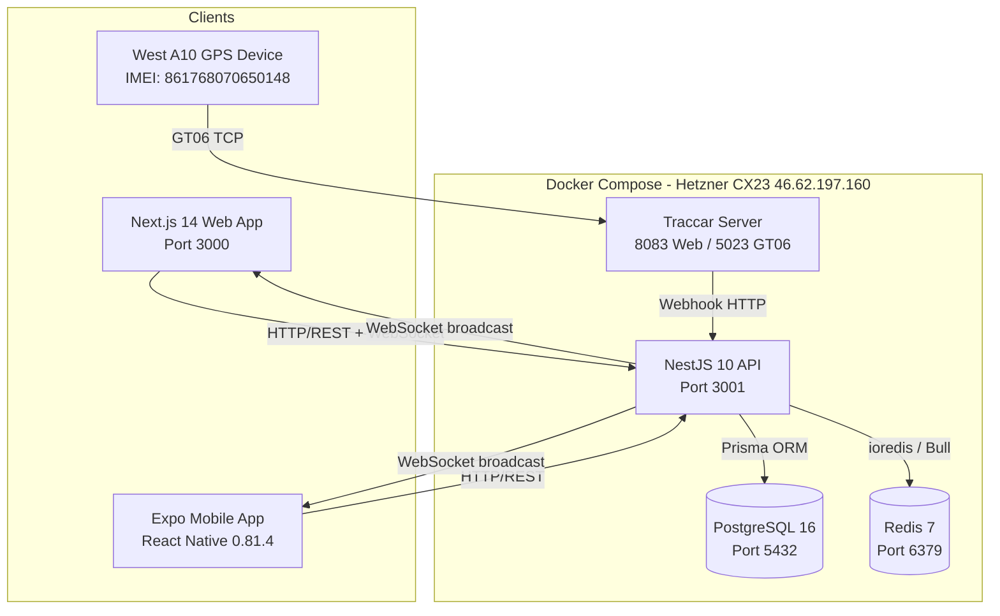
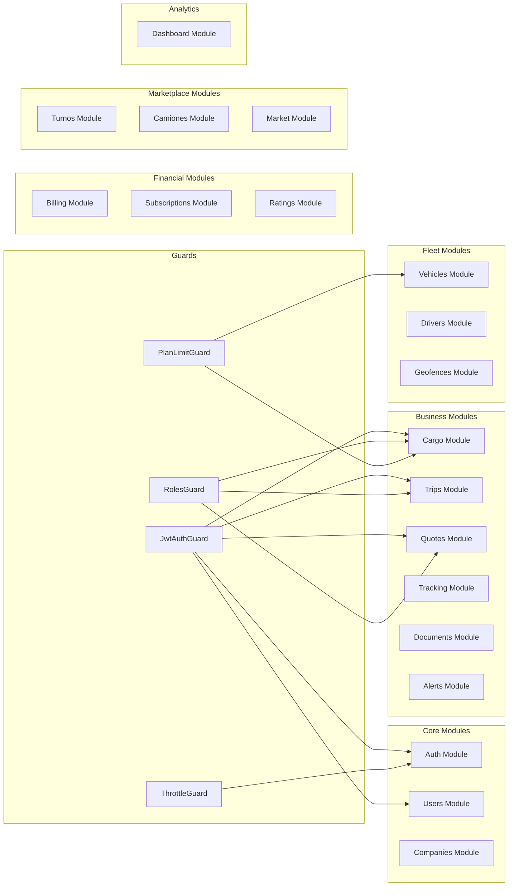
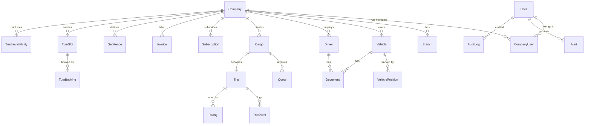
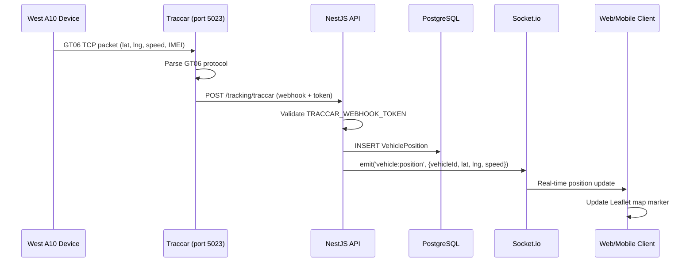
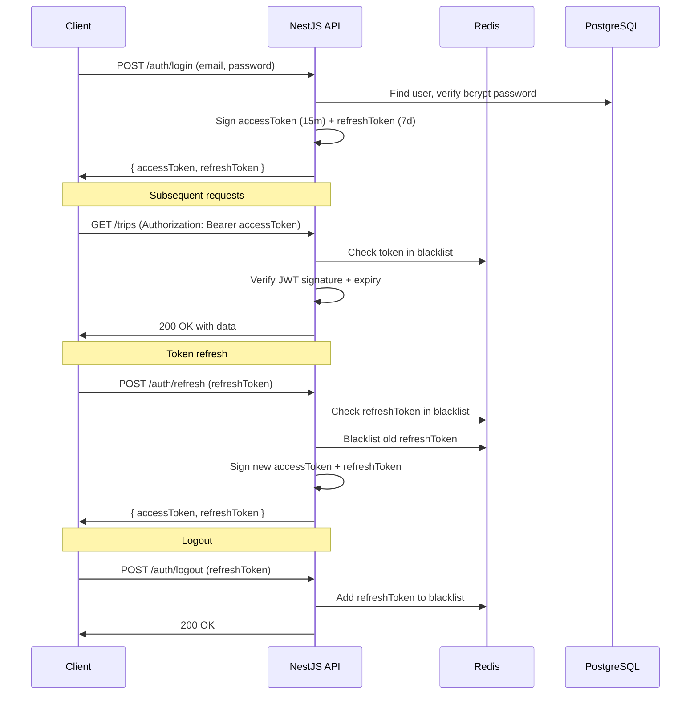
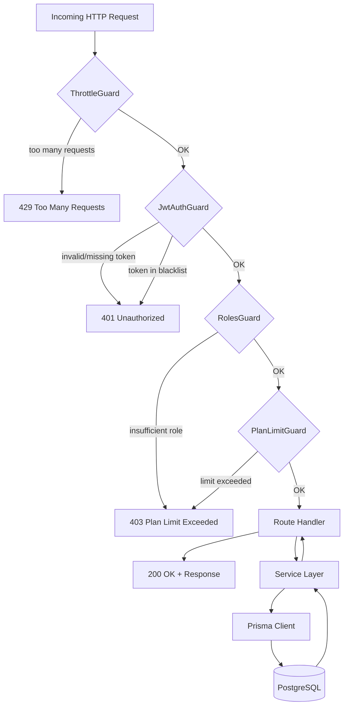
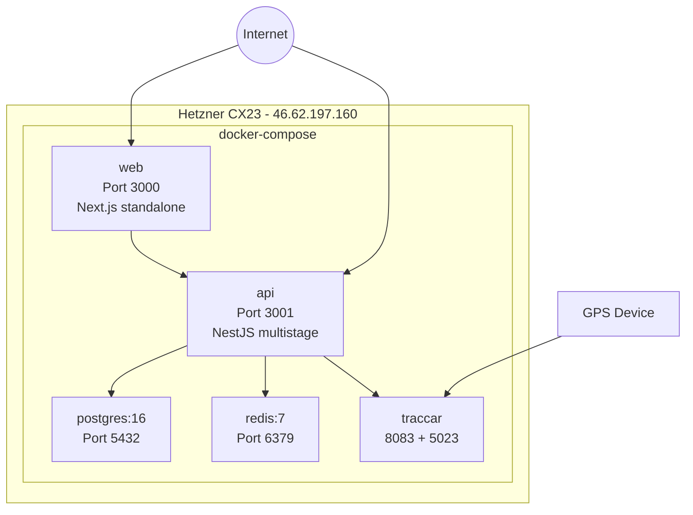

# Architecture — Logiguay

## System Overview

Logiguay is a multi-tier logistics platform composed of three main applications (API, Web, Mobile) backed by PostgreSQL and Redis, with an integrated GPS tracking pipeline through Traccar.

---

## Technology Stack

### API — Backend

| Technology | Version | Role |
|---|---|---|
| NestJS | 10 | Application framework, DI, modules |
| Prisma | 5 | ORM, migrations, type-safe queries |
| PostgreSQL | 16 | Primary relational database |
| Redis | 7 | JWT blacklist, Bull queue broker |
| Socket.io | 4 | Real-time WebSocket events |
| Bull | latest | Async job queues (alerts, notifications) |
| Node.js | (LTS) | Runtime |

### Web — Frontend

| Technology | Version | Role |
|---|---|---|
| Next.js | 14 | React framework, SSR/SSG, routing |
| React | 18 | UI library |
| next-intl | latest | Internationalization |
| TanStack Query | latest | Server state management |
| Leaflet | latest | Interactive maps |
| Recharts | latest | Data visualization charts |
| Tailwind CSS | latest | Utility-first styling |

### Mobile — App

| Technology | Version | Role |
|---|---|---|
| Expo SDK | 54 | React Native toolchain |
| React Native | 0.81.4 | Mobile UI framework |
| React | 19.1.0 | UI library |
| expo-router | 6 | File-based navigation |
| TanStack Query | latest | Server state management |

### Infrastructure

| Component | Technology | Details |
|---|---|---|
| Server | Hetzner VPS CX23 | 4GB RAM, IP 46.62.197.160 |
| Containerization | Docker + docker-compose | All services containerized |
| GPS middleware | Traccar | GT06 protocol, webhook to API |

---

## Module Architecture (NestJS API)

---

## Database Architecture

The data model is centered on the **Company** entity, with most business objects linked to a company. Key relationships:

---

## GPS Tracking Pipeline

---

## Authentication Flow

---

## Request Lifecycle (with Guards)

---

## Real-time Architecture (Socket.io)

The API maintains a Socket.io server alongside the HTTP server. Clients connect with their JWT token and join rooms based on company/trip/vehicle.

Events emitted by the API:
- `vehicle:position` — GPS position update for a specific vehicle
- `trip:status` — Trip status change
- `trip:event` — New trip event recorded
- `alert:new` — New alert for the user

---

## Deployment Architecture

### Docker Build Notes

**API Dockerfile (multistage):**
1. Builder stage: install deps, run `prisma generate`, compile TypeScript
2. Production stage: copy compiled output + generated Prisma client, run with Node

**Web Dockerfile (multistage):**
1. Builder stage: accepts `NEXT_PUBLIC_*` as build args (required for client-side embedding), runs `next build`
2. Production stage: copies `standalone` output directory, runs with Node
