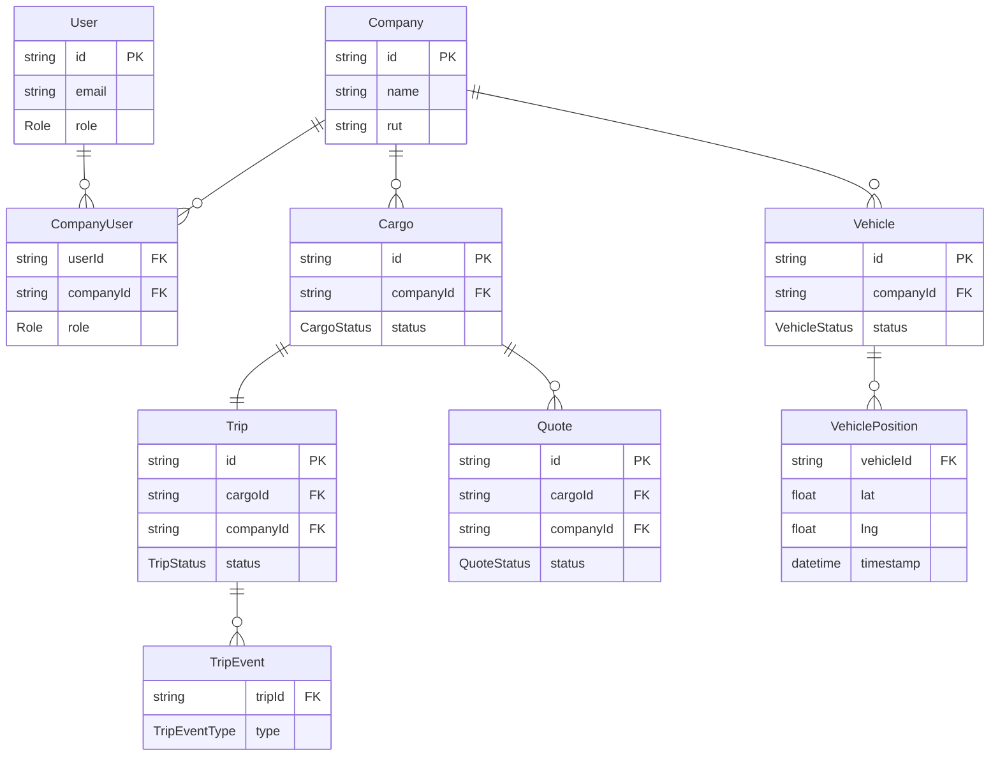

# Database Schema — Logiguay

**Database:** PostgreSQL 16  
**ORM:** Prisma 5  
**Total Models:** 22

---

## Enumerations

### Role
```
ADMIN | DADOR | TRANSPORTISTA | CHOFER
```

### CargoStatus
```
PENDIENTE | PUBLICADO | COTIZANDO | ASIGNADO | CANCELADO
```

### TripStatus
```
PENDIENTE | PUBLICADO | COTIZANDO | ASIGNADO |
EN_CAMINO_ORIGEN | EN_CARGA | EN_TRANSITO | EN_DESCARGA |
FINALIZADO | CANCELADO
```

### QuoteStatus
```
PENDIENTE | ACEPTADA | RECHAZADA
```

### VehicleType
```
CAMION | ACOPLADO | SEMIRREMOLQUE
```

### VehicleStatus
```
ACTIVO | INACTIVO | MANTENIMIENTO
```

### PlanType
```
FREE | PRO | EMPRESA | FLOTA
```

### CommissionType
```
PORCENTAJE | FIJO | HIBRIDO
```

### GeoFenceType
```
ORIGEN | DESTINO | PLANTA | ACOPIO | PUERTO | CLIENTE
```

### TripEventType
```
LLEGADA_ORIGEN | SALIDA_ORIGEN | LLEGADA_DESTINO | SALIDA_DESTINO |
DESVIO | PERDIDA_SENAL | DEMORA
```

### InvoiceType
```
VIAJE | COMISION | SUSCRIPCION
```

### InvoiceStatus
```
PENDIENTE | PAGADA | CANCELADA
```

### SubscriptionStatus
```
ACTIVA | CANCELADA | VENCIDA | TRIAL
```

---

## Models

### User

Central identity model. Users belong to companies through `CompanyUser`.

| Column | Type | Notes |
|---|---|---|
| id | String (UUID) | PK |
| email | String | Unique |
| password | String | bcrypt hashed |
| name | String | Display name |
| role | Role | ADMIN/DADOR/TRANSPORTISTA/CHOFER |
| pushToken | String? | Mobile push notification token |
| createdAt | DateTime | Auto |
| updatedAt | DateTime | Auto |

Relations: `CompanyUser[]`, `Alert[]`, `Rating[]`, `AuditLog[]`, `TurnBooking[]`

---

### Company

Core business entity. Most data in the system belongs to a company.

| Column | Type | Notes |
|---|---|---|
| id | String (UUID) | PK |
| name | String | Company name |
| rut | String? | Tax ID (Uruguay RUT) |
| phone | String? | Contact phone |
| address | String? | Physical address |
| createdAt | DateTime | Auto |
| updatedAt | DateTime | Auto |

Relations: `CompanyUser[]`, `Branch[]`, `Vehicle[]`, `Driver[]`, `Cargo[]`, `Subscription[]`, `Invoice[]`, `GeoFence[]`, `TurnSlot[]`, `TruckAvailability[]`

---

### CompanyUser

Join table linking Users to Companies with role context.

| Column | Type | Notes |
|---|---|---|
| id | String (UUID) | PK |
| userId | String | FK → User |
| companyId | String | FK → Company |
| role | Role | Role within this company |
| createdAt | DateTime | Auto |

---

### Branch

Sucursal (branch office) of a company.

| Column | Type | Notes |
|---|---|---|
| id | String (UUID) | PK |
| companyId | String | FK → Company |
| name | String | Branch name |
| address | String? | Branch address |
| createdAt | DateTime | Auto |

---

### Vehicle

Fleet vehicle registered by a transport company.

| Column | Type | Notes |
|---|---|---|
| id | String (UUID) | PK |
| companyId | String | FK → Company |
| plate | String | License plate (unique) |
| type | VehicleType | CAMION/ACOPLADO/SEMIRREMOLQUE |
| status | VehicleStatus | ACTIVO/INACTIVO/MANTENIMIENTO |
| brand | String? | Vehicle brand |
| model | String? | Vehicle model |
| year | Int? | Manufacturing year |
| capacity | Float? | Load capacity in tons |
| traccarId | String? | Traccar device identifier |
| createdAt | DateTime | Auto |
| updatedAt | DateTime | Auto |

Relations: `Document[]`, `VehiclePosition[]`, `Trip[]`

---

### Driver

Chofer (driver) associated with a transport company.

| Column | Type | Notes |
|---|---|---|
| id | String (UUID) | PK |
| companyId | String | FK → Company |
| userId | String? | FK → User (if driver has login) |
| name | String | Full name |
| dni | String? | National ID |
| phone | String? | Contact phone |
| licenseNumber | String? | Driver's license number |
| licenseExpiry | DateTime? | License expiry date |
| createdAt | DateTime | Auto |
| updatedAt | DateTime | Auto |

Relations: `Document[]`, `Trip[]`

---

### Document

Document associated with a vehicle, driver, or company. Tracked for expiry.

| Column | Type | Notes |
|---|---|---|
| id | String (UUID) | PK |
| companyId | String? | FK → Company (if company doc) |
| vehicleId | String? | FK → Vehicle (if vehicle doc) |
| driverId | String? | FK → Driver (if driver doc) |
| type | String | Document type descriptor |
| number | String? | Document number |
| issueDate | DateTime? | Issue date |
| expiryDate | DateTime? | Expiry date (monitored for alerts) |
| fileUrl | String? | S3 URL of uploaded file |
| createdAt | DateTime | Auto |
| updatedAt | DateTime | Auto |

---

### Cargo

Cargo request created by a DADOR. The starting point of the logistics flow.

| Column | Type | Notes |
|---|---|---|
| id | String (UUID) | PK |
| companyId | String | FK → Company (owner) |
| title | String | Cargo description |
| origin | String | Origin location |
| destination | String | Destination location |
| originLat | Float? | Origin latitude |
| originLng | Float? | Origin longitude |
| destLat | Float? | Destination latitude |
| destLng | Float? | Destination longitude |
| commodity | String? | Type of goods |
| weightTons | Float? | Weight in metric tons |
| loadDate | DateTime? | Planned loading date |
| deliveryDate | DateTime? | Planned delivery date |
| status | CargoStatus | Current lifecycle state |
| createdAt | DateTime | Auto |
| updatedAt | DateTime | Auto |

Relations: `Quote[]`, `Trip?`

---

### Trip

Active transport operation. Created when a cargo quote is accepted.

| Column | Type | Notes |
|---|---|---|
| id | String (UUID) | PK |
| cargoId | String | FK → Cargo (one-to-one) |
| companyId | String | FK → Company (transportista) |
| driverId | String? | FK → Driver (assigned driver) |
| vehicleId | String? | FK → Vehicle (assigned vehicle) |
| status | TripStatus | Current status (10 states) |
| startedAt | DateTime? | When trip actually started |
| completedAt | DateTime? | When trip was completed |
| createdAt | DateTime | Auto |
| updatedAt | DateTime | Auto |

Relations: `TripEvent[]`, `Rating[]`

---

### Quote

Cotización submitted by a TRANSPORTISTA for a DADOR's Cargo.

| Column | Type | Notes |
|---|---|---|
| id | String (UUID) | PK |
| cargoId | String | FK → Cargo |
| companyId | String | FK → Company (transportista) |
| price | Float | Quoted price |
| currency | String | Currency code (UYU, USD) |
| notes | String? | Additional notes |
| status | QuoteStatus | PENDIENTE/ACEPTADA/RECHAZADA |
| createdAt | DateTime | Auto |
| updatedAt | DateTime | Auto |

---

### GeoFence

Geographic zone definition for tracking and event triggering.

| Column | Type | Notes |
|---|---|---|
| id | String (UUID) | PK |
| companyId | String | FK → Company |
| name | String | Zone name |
| type | GeoFenceType | ORIGEN/DESTINO/PLANTA/ACOPIO/PUERTO/CLIENTE |
| lat | Float | Center latitude |
| lng | Float | Center longitude |
| radiusMeters | Float | Radius in meters |
| createdAt | DateTime | Auto |

---

### VehiclePosition

GPS position record. Written by the Traccar webhook handler.

| Column | Type | Notes |
|---|---|---|
| id | String (UUID) | PK |
| vehicleId | String | FK → Vehicle |
| lat | Float | Latitude |
| lng | Float | Longitude |
| speed | Float? | Speed in km/h |
| heading | Float? | Direction in degrees |
| timestamp | DateTime | GPS timestamp |
| createdAt | DateTime | Auto insert time |

Index on `(vehicleId, timestamp)` for history queries.

---

### TripEvent

Event in the timeline of a trip.

| Column | Type | Notes |
|---|---|---|
| id | String (UUID) | PK |
| tripId | String | FK → Trip |
| type | TripEventType | Event classification |
| lat | Float? | Location when event occurred |
| lng | Float? | Location when event occurred |
| notes | String? | Free text notes |
| createdAt | DateTime | Timestamp of event |

---

### Alert

Notification record for a user. Generated by the system (document expiry, geofence events, delays).

| Column | Type | Notes |
|---|---|---|
| id | String (UUID) | PK |
| userId | String | FK → User |
| title | String | Alert title |
| message | String | Alert body |
| read | Boolean | Default: false |
| type | String? | Alert category |
| entityId | String? | ID of related entity |
| entityType | String? | Type of related entity |
| createdAt | DateTime | Auto |

---

### Subscription

Company subscription to a platform plan.

| Column | Type | Notes |
|---|---|---|
| id | String (UUID) | PK |
| companyId | String | FK → Company |
| plan | PlanType | FREE/PRO/EMPRESA/FLOTA |
| status | SubscriptionStatus | ACTIVA/CANCELADA/VENCIDA/TRIAL |
| startDate | DateTime | Subscription start |
| endDate | DateTime? | Subscription end |
| createdAt | DateTime | Auto |
| updatedAt | DateTime | Auto |

---

### Invoice

Financial document generated for platform charges.

| Column | Type | Notes |
|---|---|---|
| id | String (UUID) | PK |
| companyId | String | FK → Company |
| type | InvoiceType | VIAJE/COMISION/SUSCRIPCION |
| status | InvoiceStatus | PENDIENTE/PAGADA/CANCELADA |
| amount | Float | Invoice amount |
| currency | String | Currency code |
| tripId | String? | FK → Trip (if VIAJE type) |
| dueDate | DateTime? | Payment due date |
| paidAt | DateTime? | Payment timestamp |
| createdAt | DateTime | Auto |
| updatedAt | DateTime | Auto |

---

### Rating

Post-trip rating between participants.

| Column | Type | Notes |
|---|---|---|
| id | String (UUID) | PK |
| tripId | String | FK → Trip |
| raterId | String | FK → User (who rated) |
| ratedId | String | FK → User (who was rated) |
| score | Int | Rating value (typically 1-5) |
| comment | String? | Optional comment |
| createdAt | DateTime | Auto |

Unique constraint on `(tripId, raterId)` prevents duplicate ratings.

---

### TurnSlot

Available time slot for loading/unloading at a facility.

| Column | Type | Notes |
|---|---|---|
| id | String (UUID) | PK |
| companyId | String | FK → Company (facility owner) |
| startTime | DateTime | Slot start time |
| endTime | DateTime | Slot end time |
| capacity | Int | Number of trucks per slot |
| available | Int | Remaining capacity |
| createdAt | DateTime | Auto |

Relations: `TurnBooking[]`

---

### TurnBooking

Reservation of a time slot by a transportista.

| Column | Type | Notes |
|---|---|---|
| id | String (UUID) | PK |
| slotId | String | FK → TurnSlot |
| userId | String | FK → User (who booked) |
| tripId | String? | FK → Trip (optional) |
| status | String | ACTIVE/CANCELLED |
| createdAt | DateTime | Auto |

---

### TruckAvailability

Published truck availability listing by a transportista.

| Column | Type | Notes |
|---|---|---|
| id | String (UUID) | PK |
| companyId | String | FK → Company |
| vehicleId | String? | FK → Vehicle |
| vehicleType | VehicleType | Type of vehicle available |
| availableFrom | DateTime | Availability start |
| availableTo | DateTime | Availability end |
| origin | String? | Current/departure zone |
| active | Boolean | Visible in search |
| createdAt | DateTime | Auto |

---

### AuditLog

Immutable record of significant system actions.

| Column | Type | Notes |
|---|---|---|
| id | String (UUID) | PK |
| userId | String | FK → User (actor) |
| action | String | Action description |
| entity | String | Entity type affected |
| entityId | String | Entity ID affected |
| before | Json? | State before action |
| after | Json? | State after action |
| createdAt | DateTime | Auto |

---

## Entity Relationship Overview


