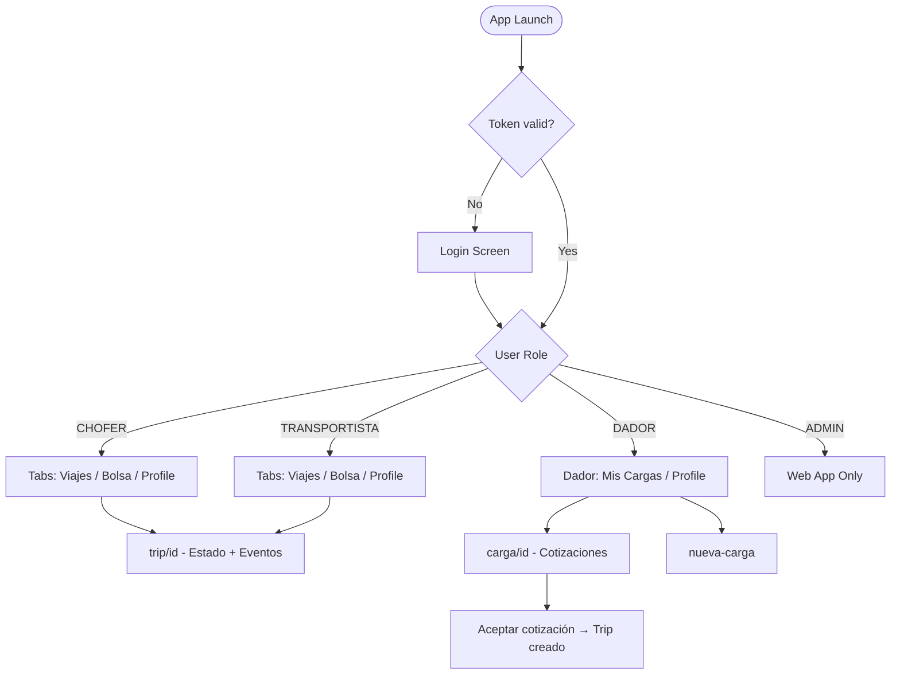

# Screens and Navigation — Logiguay

## Web Application (Next.js 14)

### Route Structure

The web app uses Next.js App Router with internationalization via `next-intl`. All routes are prefixed with a locale segment (`[locale]`).

```
/[locale]/
├── (auth)/
│   ├── login
│   └── register
└── (dashboard)/
    ├── dashboard
    ├── cargas
    │   └── nueva
    ├── bolsa
    ├── viajes
    ├── flota
    ├── choferes
    ├── documentos
    ├── facturacion
    ├── alertas
    ├── tracking
    ├── turnos
    ├── camiones-disponibles
    ├── retorno
    ├── suscripcion
    └── admin/
        ├── page (index)
        ├── empresas
        ├── usuarios
        ├── suscripciones
        ├── comisiones
        └── configuracion
```

---

### Auth Pages

#### `/[locale]/(auth)/login`
**Purpose:** User authentication  
**Roles:** Public (unauthenticated)  
**Key elements:**
- Email and password form
- Link to register
- On success: stores accessToken + refreshToken, redirects to `/dashboard`
- On failure: shows validation errors

#### `/[locale]/(auth)/register`
**Purpose:** New user registration  
**Roles:** Public (unauthenticated)  
**Key elements:**
- Email, password, name, role selector (DADOR/TRANSPORTISTA)
- Rate limited: 5 attempts per 60 seconds
- On success: auto-login, redirects to `/dashboard`

---

### Dashboard Pages

#### `/[locale]/(dashboard)/dashboard`
**Purpose:** Main overview with KPIs and charts  
**Roles:** All authenticated  
**Data sources:** `GET /dashboard/stats`, `GET /dashboard/time-series`  
**Key elements:**
- KPI cards (active trips, pending quotes, revenue, fleet status)
- Recharts time-series graphs (trips over time, revenue)
- Adapts displayed metrics based on user role

---

#### `/[locale]/(dashboard)/cargas`
**Purpose:** List and manage cargo requests  
**Roles:** DADOR, ADMIN  
**Data sources:** `GET /cargo` (filtered by JWT companyId)  
**Key elements:**
- Paginated cargo table with status badges (PENDIENTE, PUBLICADO, COTIZANDO, ASIGNADO, CANCELADO)
- Filter by status, date range
- Link to create new cargo
- Action to publish/cancel cargo

#### `/[locale]/(dashboard)/cargas/nueva`
**Purpose:** Create a new cargo request  
**Roles:** DADOR, ADMIN  
**Data sources:** `POST /cargo`  
**Key elements:**
- Form: origin, destination, commodity type, weight, load date, delivery date
- Map picker for origin/destination coordinates (Leaflet)
- Submit creates cargo in PENDIENTE status

---

#### `/[locale]/(dashboard)/bolsa`
**Purpose:** Cargo marketplace — browse and quote available loads  
**Roles:** TRANSPORTISTA (primary), DADOR (read-only view), ADMIN  
**Data sources:** `GET /cargo/marketplace`  
**Key elements:**
- Filterable cargo list (commodity, origin, destination, date)
- Cargo cards with origin, destination, weight, load date
- TRANSPORTISTA: button to submit quote with price input
- Shows number of existing quotes per cargo

---

#### `/[locale]/(dashboard)/viajes`
**Purpose:** Trip management  
**Roles:** All authenticated (filtered by role automatically)  
**Data sources:** `GET /trips`  
**Key elements:**
- Trip list with status timeline visualization
- Status badges with color coding (10 statuses)
- TRANSPORTISTA/ADMIN: assign driver and vehicle
- Link to trip detail with event timeline
- Real-time status updates via Socket.io

---

#### `/[locale]/(dashboard)/flota`
**Purpose:** Fleet (vehicle) management  
**Roles:** TRANSPORTISTA, ADMIN  
**Data sources:** `GET /vehicles`, `GET /vehicles/stats`  
**Key elements:**
- Vehicle list with type (CAMION, ACOPLADO, SEMIRREMOLQUE) and status
- Stats cards: total, ACTIVO, INACTIVO, MANTENIMIENTO
- Add new vehicle form
- Status change actions (PATCH /vehicles/:id/status)

---

#### `/[locale]/(dashboard)/choferes`
**Purpose:** Driver management  
**Roles:** TRANSPORTISTA, ADMIN  
**Data sources:** `GET /drivers`, `GET /drivers/stats`  
**Key elements:**
- Driver list with license expiry indicator
- Stats: total, active in trips, expiring licenses
- Add/edit driver form
- Document expiry warnings

---

#### `/[locale]/(dashboard)/documentos`
**Purpose:** Document management with expiry tracking  
**Roles:** All authenticated  
**Data sources:** `GET /documents`, `GET /documents/expiring`  
**Key elements:**
- Document list grouped by entity (vehicle, driver, company)
- Expiry date highlighted (red if expired, yellow if expiring within 30 days)
- Upload/link new documents
- ADMIN: trigger manual expiry check and alert generation

---

#### `/[locale]/(dashboard)/facturacion`
**Purpose:** Invoice management  
**Roles:** All authenticated (ADMIN sees all; others see own)  
**Data sources:** `GET /billing/invoices`, `GET /billing/invoices/summary`  
**Key elements:**
- Invoice list with type (VIAJE, COMISION, SUSCRIPCION) and status
- Summary cards: pending amount, paid amount
- ADMIN: mark as paid, cancel actions
- Filter by date range and status

---

#### `/[locale]/(dashboard)/alertas`
**Purpose:** Notification center  
**Roles:** All authenticated  
**Data sources:** `GET /alerts`, `GET /alerts/unread-count`  
**Key elements:**
- Alert list with unread indicator (bold/colored)
- Unread count badge in navigation
- Mark individual alert as read
- Mark all as read button
- Real-time new alerts via Socket.io

---

#### `/[locale]/(dashboard)/tracking`
**Purpose:** Live GPS tracking map  
**Roles:** All authenticated (scoped by role)  
**Data sources:** `GET /tracking/fleet`, WebSocket `vehicle:position` events  
**Key elements:**
- Leaflet map with vehicle markers
- Real-time marker movement as GPS updates arrive via WebSocket
- Click vehicle marker to see: speed, heading, last update time
- Trip route overlay for active trips
- Vehicle list sidebar with last-seen status

---

#### `/[locale]/(dashboard)/turnos`
**Purpose:** Slot booking for loading/unloading  
**Roles:** All authenticated  
**Data sources:** `GET /turnos/slots`, `GET /turnos/my-bookings`  
**Key elements:**
- Calendar view of available slots
- Slot capacity indicator
- Book slot form (select slot, optional trip association)
- My bookings list with cancel option

---

#### `/[locale]/(dashboard)/camiones-disponibles`
**Purpose:** Available truck marketplace  
**Roles:** All authenticated  
**Data sources:** `GET /camiones/search`  
**Key elements:**
- Search filters: vehicle type, origin zone, date range
- Truck cards with company info, vehicle type, available dates
- TRANSPORTISTA: manage own listings, deactivate

---

#### `/[locale]/(dashboard)/retorno`
**Purpose:** Return-trip cargo listings  
**Roles:** All authenticated  
**Data sources:** `GET /cargo/retorno`  
**Key elements:**
- Cargo listings for return trips
- Similar layout to bolsa but filtered for return routes

---

#### `/[locale]/(dashboard)/suscripcion`
**Purpose:** Subscription plan management  
**Roles:** All authenticated  
**Data sources:** `GET /subscriptions/current`, `GET /subscriptions/limits`  
**Key elements:**
- Current plan display (FREE/PRO/EMPRESA/FLOTA)
- Plan limits and usage meters
- Upgrade/change plan options
- Subscription history

---

### Admin Pages

#### `/[locale]/(dashboard)/admin/page`
**Purpose:** Admin dashboard with platform-wide stats  
**Roles:** ADMIN only  
**Key elements:**
- Platform KPIs: total companies, active subscriptions, total trips
- Recent activity feed

#### `/[locale]/(dashboard)/admin/empresas`
**Purpose:** Company management  
**Roles:** ADMIN only  
**Data sources:** `GET /companies`  
**Key elements:**
- All companies list
- Company detail with users, subscription status
- Edit company, manage members

#### `/[locale]/(dashboard)/admin/usuarios`
**Purpose:** User management  
**Roles:** ADMIN only  
**Data sources:** `GET /users`  
**Key elements:**
- All users list with role indicator
- Edit user role and status

#### `/[locale]/(dashboard)/admin/suscripciones`
**Purpose:** Subscription management across all companies  
**Roles:** ADMIN only  
**Data sources:** `GET /subscriptions/history`  
**Key elements:**
- Active subscriptions per company
- Activate/cancel subscriptions
- Subscription history

#### `/[locale]/(dashboard)/admin/comisiones`
**Purpose:** Commission configuration  
**Roles:** ADMIN only  
**Key elements:**
- Configure commission type (PORCENTAJE, FIJO, HIBRIDO)
- Set commission rates per plan or company

#### `/[locale]/(dashboard)/admin/configuracion`
**Purpose:** Platform-wide configuration  
**Roles:** ADMIN only

---

## Mobile Application (Expo SDK 54 + expo-router 6)

### Navigation Structure

```
app/
├── login.tsx
├── (tabs)/
│   ├── index.tsx          (Chofer: viajes activos)
│   ├── bolsa.tsx          (Chofer/Transportista: marketplace)
│   └── profile.tsx        (All: user profile)
├── (dador)/
│   ├── index.tsx          (Dador: mis cargas)
│   ├── nueva-carga.tsx    (Dador: create cargo form)
│   ├── carga/
│   │   └── [id].tsx       (Dador: cargo detail + cotizaciones)
│   └── profile.tsx        (Dador: profile)
└── trip/
    └── [id].tsx           (All: trip detail + status controls)
```

---

### Mobile Screens

#### `login.tsx`
**Purpose:** Authentication entry point  
**Roles:** Public  
**Key elements:**
- Email and password inputs
- Login button → calls `POST /auth/login`
- Stores tokens in SecureStore
- Navigates to appropriate tab group based on role

---

#### `(tabs)/index.tsx` — Viajes (Chofer)
**Purpose:** Active trips for the authenticated chofer  
**Roles:** CHOFER, TRANSPORTISTA  
**Data sources:** `GET /trips` (filtered by role in API)  
**Key elements:**
- Trip cards with status badge
- Pull-to-refresh
- Tap to open `trip/[id]`
- **Fix applied:** Uses `res.data.data` (not `res.data`) for paginated response

---

#### `(tabs)/bolsa.tsx` — Marketplace
**Purpose:** Cargo marketplace for quoting  
**Roles:** TRANSPORTISTA  
**Data sources:** `GET /cargo/marketplace`  
**Key elements:**
- Cargo list with origin/destination
- Submit quote with price

---

#### `(tabs)/profile.tsx` — Profile
**Purpose:** User profile and settings  
**Roles:** All  
**Key elements:**
- Display user name, role, company
- Push notification token registration (`POST /users/push-token`)
- Logout button

---

#### `(dador)/index.tsx` — Mis Cargas
**Purpose:** Cargo list for dador  
**Roles:** DADOR  
**Data sources:** `GET /cargo`  
**Key elements:**
- Cargo list with status
- Link to create new cargo
- Tap cargo to see cotizaciones

---

#### `(dador)/nueva-carga.tsx` — Nueva Carga
**Purpose:** Create cargo form  
**Roles:** DADOR  
**Data sources:** `POST /cargo`  
**Key elements:**
- Origin, destination, commodity, weight, dates
- Submit creates cargo

---

#### `(dador)/carga/[id].tsx` — Detalle de Carga
**Purpose:** Cargo detail with received quotes  
**Roles:** DADOR  
**Data sources:** `GET /quotes/cargo/:id`  
**Key elements:**
- Cargo details header
- List of cotizaciones with price, transportista name
- Accept/reject buttons per quote
- Status badge (COTIZANDO, ASIGNADO, etc.)

---

#### `trip/[id].tsx` — Detalle de Viaje
**Purpose:** Trip detail with status management  
**Roles:** CHOFER, TRANSPORTISTA, DADOR (read-only for DADOR)  
**Data sources:** `GET /trips/:id`, `GET /trips/:id/events`, `GET /trips/:id/eta`  
**Key elements:**
- Trip status with visual step indicator
- CHOFER/TRANSPORTISTA: status update buttons (contextual: shows valid next states)
- Event timeline (LLEGADA_ORIGEN, SALIDA_ORIGEN, etc.)
- ETA display
- Register new event form

---

## Navigation Flow



---

## State Management

### Web (TanStack Query)
- Each page uses dedicated query hooks for data fetching
- Mutations invalidate relevant query caches
- WebSocket events trigger query invalidations for real-time updates

### Mobile (TanStack Query)
- Same pattern as web
- Critical fix: all paginated responses accessed via `res.data.data` (not `res.data`)
- Offline state handled with stale-while-revalidate strategy
